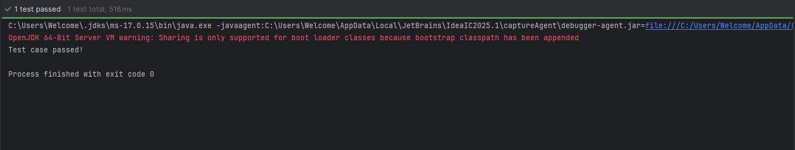

This project demonstrates Test-Driven Development (TDD) practices using JUnit5 and Mockito for mocking and stubbing in Java.

## Project Structure

```
untitled/
├── pom.xml
├── src/
│   ├── main/
│   │   └── java/
│   │       └── org/
│   │           └── example/
│   │               ├── ExternalApi.java
│   │               ├── Main.java
│   │               └── MyService.java
│   └── test/
│       └── java/
│           └── MyServiceTest.java
└── target/
```

## Description
- **ExternalApi.java**: Represents an external dependency or API.
- **MyService.java**: Contains business logic that depends on `ExternalApi`.
- **Main.java**: Entry point for the application.
- **MyServiceTest.java**: Unit tests for `MyService` using JUnit5 and Mockito for mocking/stubbing.

## Prerequisites
- Java 8 or higher
- Maven

## How to Run Tests

1. Open a terminal and navigate to the `untitled` directory.
2. Run the following command:
   ```
   mvn test
   ```
   This will execute all tests in the project using JUnit5 and Mockito.

## References
- [JUnit5 Documentation](https://junit.org/junit5/)
- [Mockito Documentation](https://site.mockito.org/) 