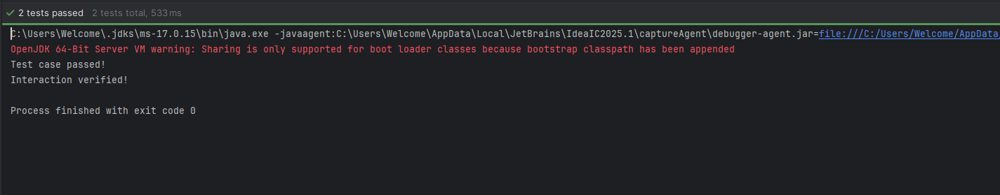

# Verifying Interactions



This project demonstrates verifying interactions in a Java application, including usage of external APIs and unit testing.

## Project Structure

```
verifying interactions/
├── img.png
├── README.md
└── untitled/
    ├── pom.xml
    ├── src/
    │   ├── main/
    │   │   └── java/
    │   │       └── org/
    │   │           └── example/
    │   │               ├── ExternalApi.java
    │   │               ├── Main.java
    │   │               └── MyService.java
    │   └── test/
    │       └── java/
    │           └── MyServiceTest.java
    └── target/
```

## Getting Started

### Prerequisites
- Java 8 or higher
- Maven

### Build the Project

Navigate to the `untitled` directory and run:

```sh
mvn clean install
```

### Run the Application

You can run the main class using:

```sh
mvn exec:java -Dexec.mainClass="org.example.Main"
```

### Run Tests

To execute the unit tests:

```sh
mvn test
```

## License

This project is for demonstration and educational purposes. 